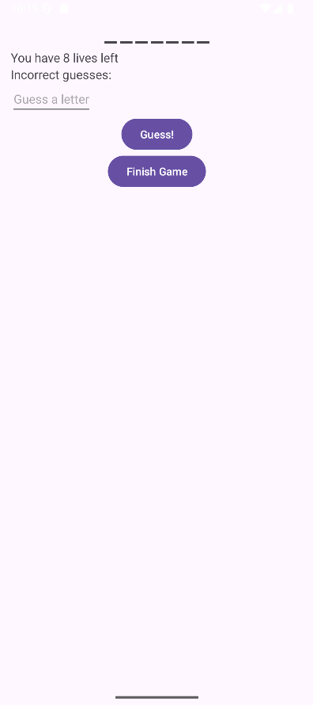
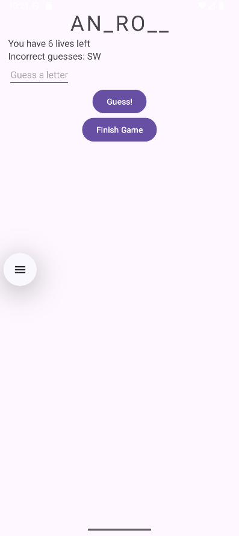

# Guessing-Game
Учебное приложение-игра, где нужно угадать слово. Проект реализован с использованием современных компонентов Android Jetpack.

# Описание
Приложение состоит из нескольких экранов (фрагментов). Пользователь вводит буквы, а приложение сообщает, угадал ли он.

# Стек технологий
- Язык: Kotlin
- Архитектура: MVVM
- Android Jetpack:
  - ViewModel для хранения бизнес-логики и данных
  - LiveData для реактивного обновления UI
  - Navigation Component для навигации между экранами
  - Safe Args для типобезопасной передачи данных между фрагментами
- UI: Fragments, Data Binding

# Ключевые навыки, демонстрируемые в проекте:
- Реализация архитектуры MVVM
- Работа с ViewModel и LiveData
- Настройка навигации между фрагментами с помощью Navigation Component
- Использование Data Binding для связывания данных с UI

# Скриншоты

  
  
  

